# Proyecto Articulos
<!-- TOC -->
* [Proyecto Articulos](#proyecto-articulos)
  * [🔁Recordatorio del pt02](#recordatorio-del-pt02)
    * [Gestion de articulos](#gestion-de-articulos)
        * [🥇Vistas principales](#vistas-principales)
        * [🥈Vistas secundarias](#vistas-secundarias)
        * [💥Vista de error](#vista-de-error)
        * [♻️Componentes reusables de estilo](#componentes-reusables-de-estilo)
    * [🎢Workflow](#workflow)
    * [🍱MISC](#misc)
  * [➡️Cambios con respecto a la version anterior en pt03](#cambios-con-respecto-a-la-version-anterior-en-pt03)
    * [🧐👆Justificacion de los cambios](#justificacion-de-los-cambios)
  * [➡️Cambios con respecto a la version anterior en la nueva pt04](#cambios-con-respecto-a-la-version-anterior-en-la-nueva-pt04)
    * [🧐👆Justificacion de los cambios](#justificacion-de-los-cambios-1)
<!-- TOC -->
## 🔁Recordatorio del pt02

### Gestion de articulos

Mi proyecto tiene 4 pilares fundamentales:

1- ```index.php``` este hace de "enrutador" y gestiona las peticiones ```get```,llamando a las respectivas vistas, y ```post``` llamando las funciones del controlador correspondientes.

2- ```controlador.php``` este se encarga de obtener ```los datos del modelo``` segun sea necesario e incluir las vistas para mostrarlos. Además valida los inputs con funciones de validacion y emite el html pertinente para que sea usado en la vista.

3- ```db.php``` este se encarga de conectar con la base de datos (usando ```connect.php```), de ejecutar las sentencias y devolver los datos en arrays asociativas.

4- las diversas vistas:

##### 🥇Vistas principales

* ```read.php``` (vista de seleccion para leer, página principal)
* ```update.php``` (vista de seleccion para update)
* ```insert.php``` (formulario de inserción)
* ```delete.php``` (vista de seleccion para delete)

Son las vistas con las que el usuario interactua al principio de todo. son tratadas por el index en el GET.


##### 🥈Vistas secundarias

* ```reading.php``` (vista de lectura de un elemento)
* ```updating.php``` (formulario de actualización de un elemento)
* ```deleting.php``` (formulario de borrado de un elemento)

##### 💥Vista de error

* ```404.php``` (vista de error 404, imagen sacada de httpcats)


##### ♻️Componentes reusables de estilo

* ```nav.php``` (componente de navegación)
* ```estilos.php``` (link de importacion de css)

### 🎢Workflow

El usuario tiene acceso a las paginas principales y puede:

* Ver todos los articulos, clickar en uno y leerlo
* Insertar un nuevo articulo y luego volver a la vista principal
* Actualizar un articulo y volver al menu para seleccionar otro y actualizarlo
* Borrar un articulo, volver al menu para seleccionar otro y borrarlo

Cuando se hace una peticion a las vistas principales el index controla la peticion y redirige a la vista correspondiente

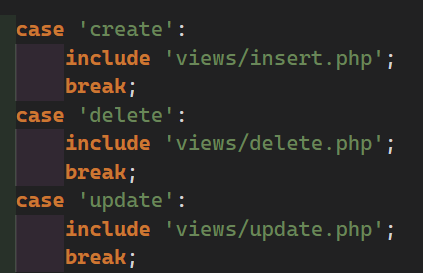

Dentro de cada pagina hay un script que se encarga de detectar el click y hacer la peticion ```GET``` correspondiente con el id del elemento clickado.

Todos los scripts tienen una estructura similar pero cambiando la action

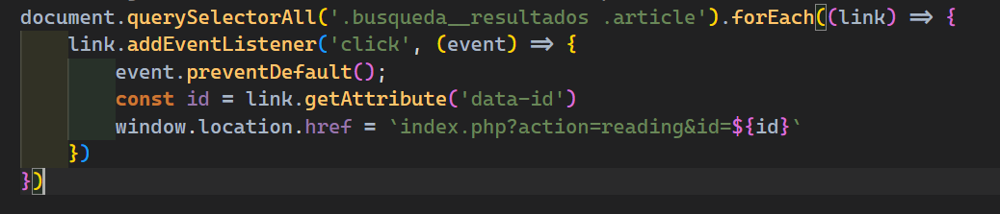

Esta peticion, segun sea el caso, es gestionada por el ```index.php``` y como las páginas que serán pintadas tienen datos en funcion del ``$id`` llama al controlador pasandole los datos de la peticion.

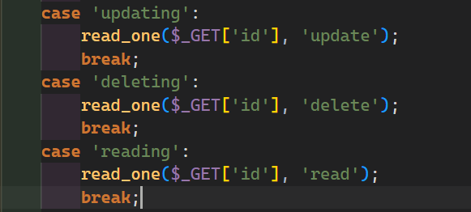

En la funcion ```read_one``` se obtienen los datos y se pintan las páginas en funcion de la `$action` pasada

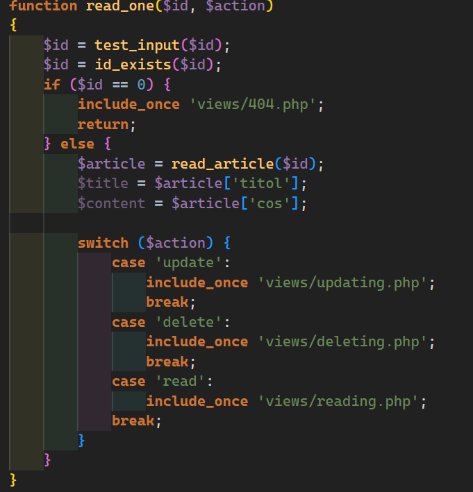

En todas se obtienen los datos y se pasan mediante las variables $title y $content para que sean pintadas en el contenedor correspondiente, siempre comprobando que esten seteadas

Ejm (reading.php):

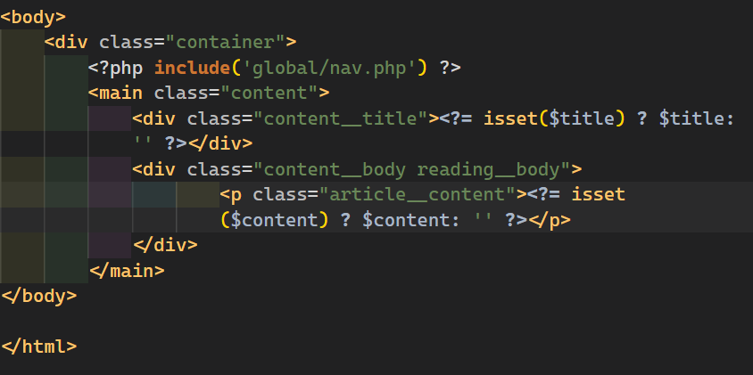

En el caso de updating y deleting hay un formulario en la pagina que contiene un submit

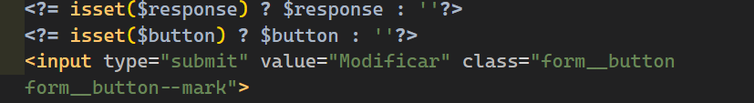

El submit hace la peticion ```POST``` que envía el id del elemento clickado, ademas del título y el contenido según sea el caso, por parametro de url. Esta peticion la recibe el `index.php` que llama al controlador pasandole los datos recibidos.

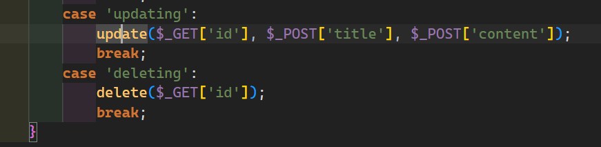

El controlador verifica que el id exista, que los campos no esten vacios, que se no haya inyeccion de codigo.

*** test_input -> sanitiza el input (ver funcion en controlador)***

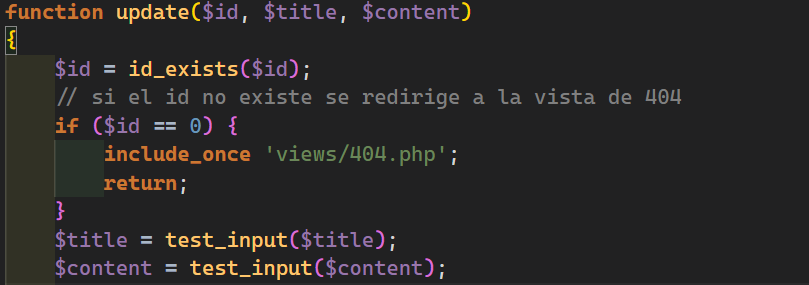
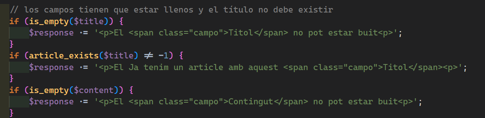

Una vez hechas las comprobaciones, entonces se mandan los datos a modelo para ejecutar la sentencia.

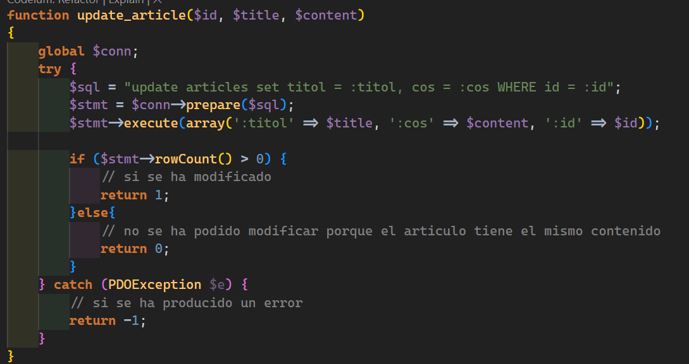

Las funciones del modelo retornan flags al controlador para comprobar si se ha podido hacer la operación y asi enviar los mensajes correspondientes a la vista.

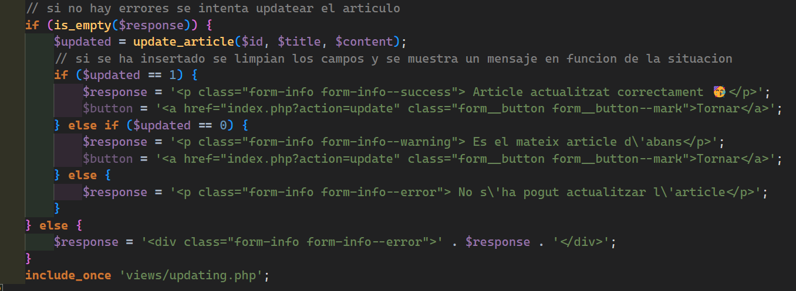

### 🍱MISC

-> La funcion de filtrado funciona haciendo peticiones get que gestiona el index con la `$action` de filter.

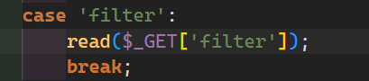

La funcion read del controlador admite un parametro opcional que es el filter y a su vez la funcion del modelo `read_articles($filter)` también (filter es un string o ''). Por defecto no hay filter y por tanto se muestra todo pues la sentencia `RLIKE ''` machea todos los articulos

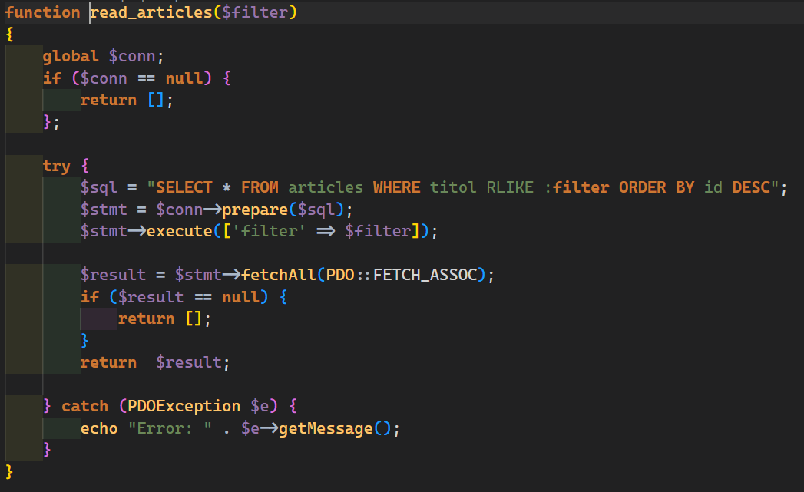

El array asociativo que se retorna se devuelve a controlador, este le pone los elementos HTML y CSS correspondientes y lo envia a la vista.

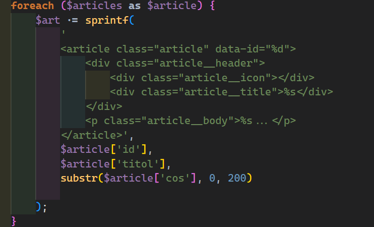

-> `El unico javascript que hay en este codigo es para hacer redirecciones usando event listeners`

-> Los efectos visuales son Css puro animando el on hover de los pseudo elementos `::before` y `::After`

-> Los estilos css estan en formato BEM, es decir, no hay estilos por id. Esto hace facil el reutilizar estilos y poder ponerselos desde el php dinamico.

-> hay dos componentes globales html, nav y el link de los estilos. Esto se hizo asi para evitar reescribir todas las veces el nav y los estilos.

## ➡️Cambios con respecto a la version anterior en pt03

Se han añadido nuevas funciones que se encargan del compaginado 

📄Controlador.php:

* `function paginate($page = PAGE, $limit = LIMIT, $filter = FILTER)`

* `function crear_links($limit = LIMIT, $page = PAGE, $filter = FILTER)`

* `function max_articles()`

📄db.php:

* `function obtener_total($filter = FILTER)`

* `function obtener_articulos($page = PAGE, $limit = LIMIT, $filter = FILTER)`

Se han modificado las vistas para que trabajen con las nuevas funciones y se ha agregado un componente nuevo dentro de 📁Global

📚 vistas

* `read.php`
* `delete.php`
* `update.php`

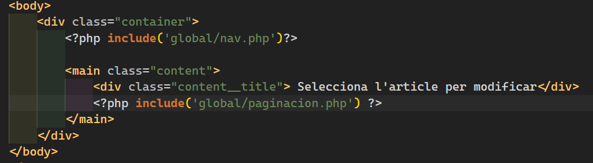


Se ha repensado la manera de añadir el filter a la url teniendo en cuenta los nuevos parametros de `page` y `limit` y manteniendo el action de `update` y `delete` intactos.

Se han eliminado los archivos de `filterM.js` y `filterD.js` y se han sustituido en las vistas por `filter.js` que funciona para todos los casos.

Se ha agregado además `paginacion.js `, que sirve para actualizar el parametro `limit` cada vez que el campo con el numero de articulos por paginas cambia.

Naturalmente, se han agregado estilos nuevos para la barra de paginacion.

### 🧐👆Justificacion de los cambios

La intencion al hacer un nuevo componente global es cambiar la menor cantidad de codigo posible y mantener el funcionamiento anterior con la mejora de la paginacion.

La logica es la misma, principalmente solo se ha sustituido el uso de la funcion read() por la funcion paginate() y se ha agregado la barra de paginacion usando crear_links().

## ➡️Cambios con respecto a la version anterior en la nueva pt04

Se ha modificado la base de datos para agregar usuarios y autores a los articulos

-> Usuarios de muestra en la base de datos:

* `admin` - `admin@admin.com` - `admin`
* `roger_51` - `4hogrlwp4@talk21.com` - `eP1oC2rG`
* `luisangel_72` - `ivl77yaca@lycos.es` - `kH5kB1cO`
* `martin_71` - `47vjms9v@talk21.com` - `mC1eJ2fB`

-> Se ha reestructurado el proyecto para que funcione con un controlador y un modelo fraccionado en diferentes archivos, e incluirlos cuando se necesiten

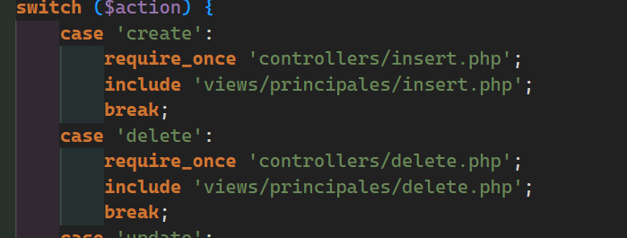
-> Se han agrupado las vistas principales y las secundarias en subcarpetas dentro de views

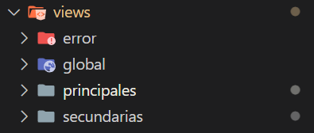

->Se ha implementado una validación dentro del `index.php` que distingue entre usuarios logueados y anónimos, permitiendo que cada uno acceda únicamente a las rutas correspondientes. 


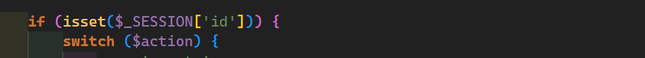

Como usuario anonimo puedes ver todos los articulos de la base de datos e iniciar sesion o registrarte

Como usuario logueado puedes crear, editar o eliminar articulos que sean de tu autoria. Ademas de leer todos los articulos que estan en la aplicacion.

-> Se ha agregado la funcionalidad para cambiar la contraseña del usuario logueado

-> Se ha agregado la funcionalidad de guardar la ultima pagina visitada


### 🧐👆Justificacion de los cambios

Para el login y el logout he usado session porque a la hora de manejar credenciales sensibles es mas seguro almacenarlas en el servidor, ademas de que tienen persistencia aun si se redirecciona.

He usado cookies para guardar el limit o la pagina en la que se quedo el usuario porque son datos que puedo obtener desde javascript, son especificos de cada usuario y ademas no necesitan seguridad extra.

## ➡️Cambios con respecto a la version anterior en la nueva pt05

-> Se ha agregado el dashboard del usuario, se pueden cambiar los siguientes datos:
  - portada
  - imagen
  - correo
  - contraseña
  - biografia
  - username

-> los usuarios se pueden autenticar con google, github o contraseña

-> Se guardan las 5 busquedas mas recientes de los usuarios

-> se guardan en una cookie el limite y la pagina en la que se quedo el usuario, de manera global.

-> se puede recuperar la contraseña desde la vista del login

-> El usuario admin tiene permisos para eliminar otros usuarios.

-> En el htaccess del dominio se activan opciones para evitar que se vean los errores por defecto de 404 y 403, se evita el acceso a archivos delicados como el propio htaccess o el env, ademas de forzar el https.

-> La pagina en la que esta el usuario esta resaltada 

-> los usuarios pueden ver sus contraseñas cuando las escriben


### 🧐👆Justificacion de los cambios

La recuperacion de contraseña se hace con un enlace que se envia al usuario al correo registrado en la base de datos, para verificar que es el usuario quien la solicita.

Cuando se elimina un usuario se mantienen los articulos pero aparece que se ha eliminado el autor. En la base de datos estos articulos tienen el campo de autor nulo. Esto para no perder la informacion y los admins pueden ponerse como autores si lo desean desde la base de datos

Los popups del dashboard del usuario se hacen mediante ajax porque si se recarga la pagina desaparece el popup.

se ha usado composer para el manejo de paquetes de dependencias como hybridauth y OAuth. 

## ➡️Cambios con respecto a la version anterior en la nueva pt06

-> Se ha implementado una api para que los usuarios tecnicos puedan consultar los articulos y usarlos en sus propios proyectos

-> se ha implementado un sistema de compartir articulos mediante QR


  + los usuarios pueden escoger si quieren que los articulos sean replicables o no, esto funciona para articulos nuevos o editando los ya existentes.

  + Cuando un articulo es replicable aparece un icono que lo indica y desde la vista de lectura se puede generar un QR incluyendo el contenido deseado(titulo,contenido o ambos). 
  
  En el caso del titulo se puede incluir a modo de plantilla pero tendra que ser modificado luego.

  + Desde el panel de creación de articulos, hay un boton para poder subir el Qr generado y crear uno nuevo a partir de él. Será necesario que el titulo sea cambiado pues no pueden haber articulos con el mismo nombre.
